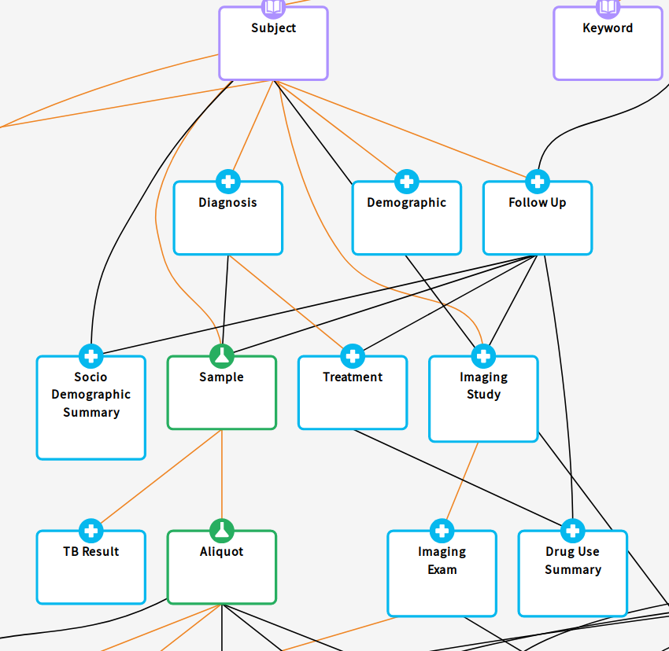

# Gen3 Tube ETL - a process from PostgreSQL to ElasticSearch 

 

## Purpose

Providing a quick response for every data query is challenging, since we need to balance the drawback of the data storage space and the performance of the query. Given a database schema represented in the figure, querying all the data from all the data tables requires multiple joins to connect the data to each other.

SQL databases provide an optimal and standard way to store data. For that optimization in processing or retrieving data, we pay the price in saving space. Given a database with a schema such as the one in the figure above, in order to gather all information related to `Subject` in descendant tables, we need perform sixteen joins (one per link). With big data, it is an expensive task.

NoSQL and document databases offer a way to circumvent the cost by duplicating data or materializing necessary values for the frequent requests. Normally, when data are received by the system, they are stored in the "source of truth" database and streamed to the secondary document database via an Extract-Transform-Load (ETL) process.

The Gen3 Tube ETL is designed to translate data from a graph data model, stored in a PostgreSQL database, to indexed documents in ElasticSearch (ES), which supports efficient ways to query data from the front-end. The purpose of the Gen3 Tube ETL is to create indexed documents to reduce the response time of requests to query data. It is configured through an `etlMapping.yaml` configuration file, which describes which tables and fields to ETL to ElasticSearch.

## Key documentation

* [ETL overview](docs/OVERVIEW.md): more information about general ETL processes
* [How to configure the Gen3 Tube ETL](docs/configuration_file.md)
* [Configuration examples](docs/examples/README.md)
* [Local development installation guide](docs/INSTALL.md)
* [How to run unit tests locally](docs/run_tube_tests_locally.md)
* [Configuring SSL](docs/configure_ssl.md)

## Gen3 graph data flow

