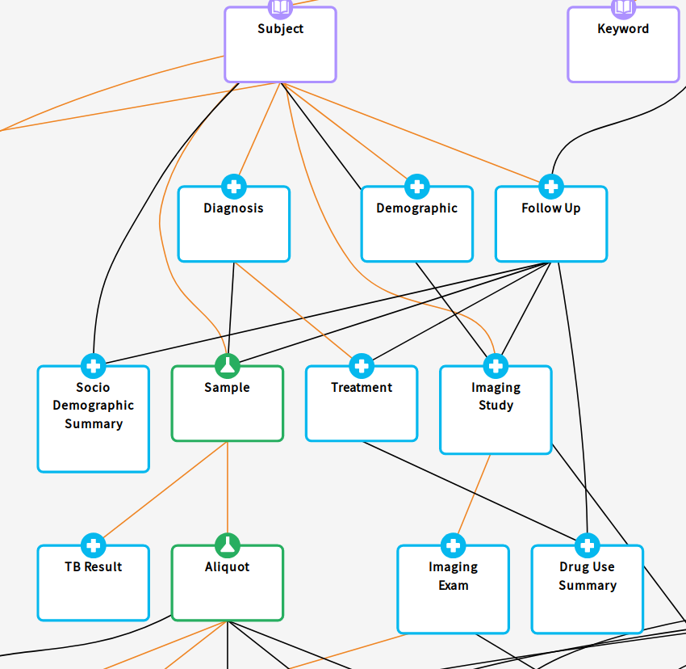

# Gen3 ETL - a process from Postgresql to ES

[](https://travis-ci.com/uc-cdis/tube)

Providing a quick response for every data query is challenging, since we need to balance the drawback of the data storage space and the performance of the query. Given a database schema represented in the figure, query the whole data from all data tables requires multiple joins to connect data to each other.



SQL databases provide us an optimal and standard way to store data. However, we must pay the cost to process or retrieve data for that optimization on the saving space. Given a database with schema as in the figure above, in order to gather all information related to `Subject` in descendant table, we need perform sixteen joins (one per link). With big data, it is an expensive task.

NoSQL and documented database offer a way to circumvent the cost by duplicating data or materializing necessary value for the frequent requests. Normally, when data being received by the system, they are stored in the source-of-truth database and being streamed to the secondary documented database via the Extract-Transform-Load (ETL) process.  

Gen3 ETL is designed to translate data from a graph data model stored in Postgresql database to indexed documents in ElasticSearch (ES) which supports the efficient way to query data from the front-end. As all other general ETL process, the purpose of Gen3 ETL is to create indexed document to reduce the responding time of every request to query data.

Refer to [Overview](docs/OVERVIEW.md) for more informaiton about general ETL process. In the section below, we specifically focus on Gen3 ETL's transformer.

## Mapping
We need a way to specify how we want to materialize data from `source-of-truth` database to an indexing data source.

Given a schema with multiple one-to-many or many-to-many relationships as in the figures, literally, there are several ways of joining data from different table together.
1. Storing complete children (relationally) tables inside the parent (relationally) table so that we can freely do whatever we want later.
2. Pre-computing all necessary fields of an index
3. Add extra/redundant key from parent node to children nodes to reduce the times of joining nodes.

We choose the later two approaches to implement in `Tube`. They are implemented as two mapping syntax.
 1. `aggregation` allows to pre-compute and integrate data from multiple nodes in original dataset to an individual one in the target dataset.
 2. `injection` allows to embed some fields in high level node to lower level nodes to reduce the time doing joining.

For all the indices, the properties (`props`) are a fundamental concept representing to all the fields that are expected in the final ElasticSearch index. For every `prop`, we must specify `name` as the final property's name in the output index. Besides, all following property are optional:
- `path`: specify the path through all the intermediate nodes reaching to the node which contains properties to put in the final index.
- `src`: the name of original property in the node.
- `fn`: the aggregation function to be executed with the property. We support 6 aggregation functions including `count, max, min, sum, list, set`
- `value_mappings`: the list of value renaming which use the alter the value of field in the final index comparing with the source-of-truth database.
- `sorted_by`: the way to choose **ONE** node out of the list of value multiple nodes of a `many-to-*` relationship.

Created properties will be grouped by the two approaches aforementioned (`aggregation, colleciton`)

### Aggregation ETL
By `aggregation` ETL approach, we can produce the properties that are:
1. associated properties from different node if the added information does not exponentially increase the size of final document. This kind of properties can be added to `flatten_props` of a `aggregation` index. Only fields from nodes which have `one-to-one` relationship with the root node are added. For nodes that has `many-to-*` relationship with the root node, it can be include to `flatten_props` with a `sorted_by` declaration that help to select one particular representation of the list of entries. We can also add any field of the node that has `many-to-*` relationship with the root nodes to `aggregated_props` by specifying an aggregation function on the field.
2. pre-computed properties that require multiple joins. These properties are specified under `aggregated_props`. For every property in `aggregated_props`, the `path` are required.


Below is an example ETL mapping file with inline comments (if you are looking to copy/paste a file as an example, please find one on Github as the inline comments will cause formatting issues):

```
mappings:
  - name: clinical_data_genericcommons // name of ElasticSearch index
    doc_type: subject // doc type of index - can be whatever but must match what is in the guppy config in the manifest.json
    type: aggregator
    root: subject // root node in Postgres
    props: // attributes on the root node to include in ETL
      - name: submitter_id
      - name: project_id
    parent_props:
      - path: studies[study_objective,study_submitter_id:submitter_id]
    flatten_props: // nodes underneath the root node to include
      - path: demographics // node underneath the root node. Must be the “backref” name of the node (example here)
        props: // attributes on this node to include
          - name: gender
            value_mappings:
              - female: Female
              - male: Male
              - unspecified: Not Specified
              - not reported: Not Specified
              - unknown: Unknown
          - name: race
          - name: ethnicity
          - name: year_of_birth
          - name: study_center
            src: country_of_birth
      - path: diagnoses
        props:
          - name: comorbidity_anemia
          - name: comorbidity_renal_disease
          - name: primary_diagnosis
          - name: type_of_resistance
        sorted_by: updated_datetime, desc
    aggregated_props: // used to get aggregate statistics of nested nodes
      - name: _samples_count // gets the count of this node name
        path: samples // path to this node from the root
        fn: count
      - name: _aliquots_count
        path: samples.aliquots // because this path starts with “samples”, the “samples” count block occurred first in this file
        fn: count
      - name: _read_groups_count
        path: samples.aliquots.read_groups
        fn: count
      - name: _type_of_resistances
        src: type_of_resistance
        path: diagnoses
        fn: set
      - name: treatment_status
        src: treatment_status
        path: follow_ups.treatments
        fn: list
    joining_props: // this is used to join two indices, most commonly, to get all the files associated with a cohort of cases
      - index: file // the index to join on
        join_on: case_id // the identifier to join on
        props: // attributes from this new index to pull into the ETL
          - name: data_format
            src: data_format
            fn: set
          - name: data_type
            src: data_type
            fn: set
```

### Injecting ETL
On another side, `injection` approach helps to embed the parent's id into the grand children nodes of dictionary. Redundantly embedding parent's id into grand children node reduces the time to perform join operation between nodes.

The required field to be specified for each property is `name`. All `injecting_props` are grouped by the node containing the properties. In the example below, the node is `subject`.
```
  - name: file_genericcommons // another index
    doc_type: file // can be anything but must match guppy config
    type: collector
    root: None
    category: data_file // if omitted, the default is "data_file"
    props: // properties to collect from files
      - name: object_id
      - name: md5sum
      - name: file_name
      - name: file_size
      - name: data_format
      - name: data_type
      - name: state
      - name: source_node // special built-in prop -- see note below
    injecting_props:
      subject:
        props:
          - name: subject_id
            src: id
          - name: project_id
```
##### `source_node` Property
A `collector` etlMapping can use the special built-in `source_node` property to include the node in the dictionary that the entity comes from. For example, if a data file is from the `reference_file` node on the dictionary, the value of `source_node` will be `"reference_file"`.

This is useful if we are ETL-ing data files because in many dictionaries, data files can be located on one of several nodes, and sometimes it's helpful to know where each data file came from. For example, PFB export of data files in portal (https://github.com/uc-cdis/data-portal/pull/729) relies on `source_node` in order to tell the `pelican-export` job where in the dictionary to search for data files.
